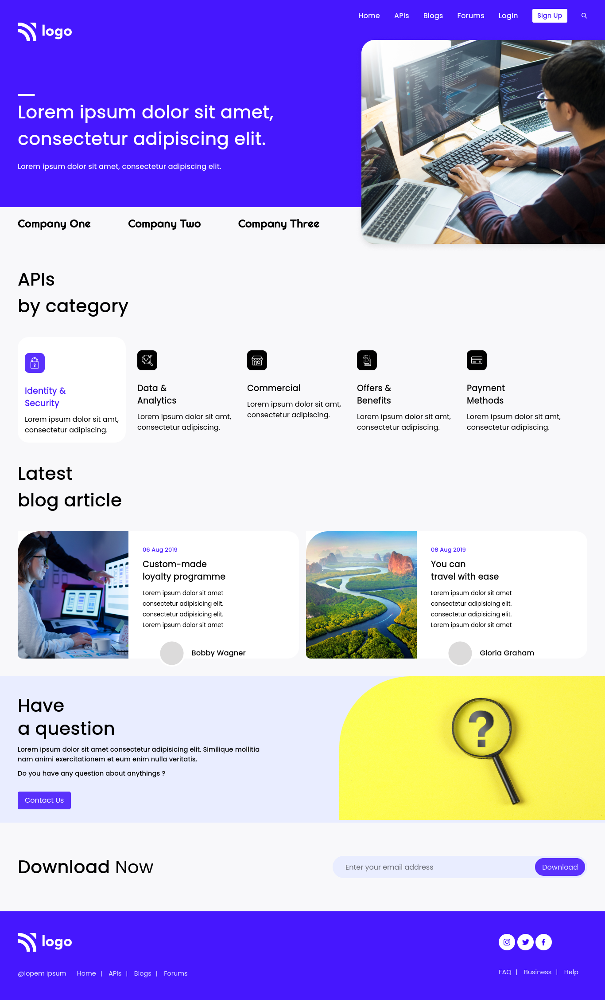

# This is a landing page for a developer
Made by **Aditya Kadali**

## Screenshots:

## Built with:

- Semantic HTML
- CSS
- Flexbox
- Grid Layout

## Key learnings:

- In this project I learned how to handle different sections of a webpage.
- I learned to place card components using grid system.
- I learned to place components using the position propety.

## Time taken:

- This project took me a little less than 4 hours to build.

## Links:

- [Live Demo](https://developer-landingpage.netlify.app/)
- [Source code](https://github.com/Adityakadali/Developer-landingpage)